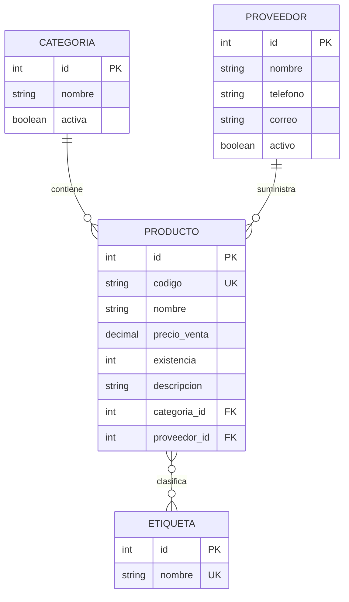

# Practica: Persistencia y relaciones con Spring Data JPA

## Estructura

- `controller`: controladores REST de categorias, productos, proveedores y etiquetas.
- `dto`: DTOs Request/Response para categorias, productos, proveedores y etiquetas.
- `entity`: entidades JPA `Categoria`, `Producto`, `Proveedor` y `Etiqueta`.
- `repository`: interfaces `JpaRepository` y consultas por categoria/etiqueta.
- `service`: logica de negocio de productos y asociaciones de etiquetas.
- `db/migration`: migraciones versionadas V1, V2, V3 y V4.

## Diagrama de relaciones



## Endpoints para Postman

Todos usan `Content-Type: application/json`.

| Metodo | URL | Uso |
|---|---|---|
| GET | `/api/categorias` | Listar categorias |
| POST | `/api/categorias` | Crear categoria |
| GET | `/api/productos` | Listar productos |
| GET | `/api/productos/{id}` | Buscar producto |
| POST | `/api/productos` | Crear producto mediante DTO |
| PUT | `/api/productos/{id}` | Actualizar producto mediante DTO |
| DELETE | `/api/productos/{id}` | Eliminar producto |
| GET | `/api/productos/categoria/{categoriaId}` | Productos por categoria |
| GET | `/api/productos/etiqueta/{etiquetaId}` | Productos por etiqueta |
| POST | `/api/productos/{productoId}/etiquetas/{etiquetaId}` | Asociar etiqueta |
| DELETE | `/api/productos/{productoId}/etiquetas/{etiquetaId}` | Quitar solo la asociacion |
| GET | `/api/proveedores` | Listar proveedores |
| POST | `/api/proveedores` | Crear proveedor |
| GET | `/api/etiquetas` | Listar etiquetas |
| POST | `/api/etiquetas` | Crear etiqueta |

Categoria:

```json
{
  "nombre": "Computadoras",
  "activa": true
}
```

Proveedor:

```json
{
  "nombre": "Distribuidora Tecnologica",
  "telefono": "2255-0101",
  "correo": "ventas@distribuidora.test",
  "activo": true
}
```

Producto:

```json
{
  "codigo": "LAP-001",
  "nombre": "Laptop Lenovo",
  "categoria": { "id": 1 },
  "proveedor": { "id": 1 },
  "precioVenta": 850.00,
  "existencia": 10,
  "descripcion": "Laptop para oficina"
}
```

Producto mediante `ProductoRequestDTO`:

```json
{
  "codigo": "TEC-001",
  "nombre": "Teclado mecanico",
  "precioVenta": 75.50,
  "existencia": 20,
  "categoriaId": 2,
  "proveedorId": 1,
  "descripcion": "Teclado mecanico para oficina"
}
```

Las respuestas de la API usan DTOs y no exponen directamente las entidades JPA. Un producto responde con `categoriaId`, `categoriaNombre`, `proveedorId`, `proveedorNombre` y una lista resumida de etiquetas.

Etiqueta:

```json
{
  "nombre": "Oferta"
}
```

Crear las etiquetas `Oferta`, `Importado`, `Empresarial`, `Portatil` y `Gaming`. Para asociar una etiqueta existente a un producto se usa `POST /api/productos/1/etiquetas/1` sin body. Para quitar solo la asociacion se usa `DELETE` en la misma URL.

Los DTOs evitan ciclos JSON y ocultan las colecciones inversas de las entidades JPA.

## Respuestas de comprobacion

1. Spring Data JPA crea una implementacion de acceso a datos a partir de interfaces como `JpaRepository`.
2. Hibernate es la implementacion ORM que transforma objetos Java en registros SQL y viceversa.
3. JPA es una especificacion; Hibernate es una implementacion de esa especificacion.
4. `@Entity` indica que una clase se persiste como una tabla de base de datos.
5. `@ManyToOne` indica que muchos productos pueden pertenecer a una categoria o proveedor.
6. `@JoinColumn` indica la columna que contiene la clave foranea de la relacion.
7. `JpaRepository` proporciona operaciones CRUD, paginacion y consultas basicas sin escribir SQL repetitivo.
8. Las migraciones versionan los cambios del esquema y permiten reproducirlos de forma ordenada.
9. V1 crea las tablas iniciales, V2 agrega la descripcion y V3 crea proveedor y su relacion con producto.
10. Una relacion bidireccional puede producir recursion infinita al convertir las entidades a JSON. Se evita ignorando una de las dos direcciones.

## Comprobacion del Laboratorio 1

1. Una clase Service concentra la logica de negocio y coordina repositorios y validaciones.
2. El controlador debe manejar HTTP; separar la logica facilita pruebas, mantenimiento y reutilizacion.
3. Un DTO es un objeto para transportar los datos de una peticion o respuesta sin exponer directamente la entidad.
4. La entidad JPA representa el modelo persistente; el DTO representa el contrato de entrada o salida de la API.
5. Recibir `categoriaId` evita que el cliente envie una entidad completa y permite validar la categoria en el Service.
6. `@OneToMany` representa una categoria con muchos productos y `@ManyToOne` muchos productos para una categoria.
7. La clave foranea `categoria_id` se almacena en la tabla `producto`.
8. `@ManyToMany` representa que un producto puede tener muchas etiquetas y una etiqueta muchos productos.
9. `@JoinTable` configura la tabla intermedia que conecta ambas entidades.
10. `producto_etiqueta` es necesaria porque una relacion N-N no puede almacenarse en una sola clave foranea.
11. El Repository encapsula el acceso a datos y proporciona operaciones CRUD y consultas derivadas.
12. El flujo es: Cliente envia HTTP, Controller recibe, Service valida y aplica reglas, Repository persiste y PostgreSQL almacena.

## Evidencias para adjuntar

- Configuracion de `application.properties`.
- Arbol de paquetes bajo `src/main/java`.
- Entidades y anotaciones JPA.
- DTOs Request/Response de todas las entidades.
- Diagrama de relaciones incluido arriba.
- Archivos V1, V2, V3 y V4.
- Capturas de GET, POST, PUT y DELETE de productos en Postman.
- Captura de consulta de productos por categoria.
- Captura de asociacion y eliminacion de asociacion de etiquetas.
- Tabla `flyway_schema_history` en PostgreSQL mostrando version 4.
- Tablas `categoria`, `producto`, `proveedor`, `etiqueta` y `producto_etiqueta`.

## Conclusion

La aplicacion implementa persistencia con Spring Data JPA y Hibernate sobre PostgreSQL.
Flyway mantiene el esquema mediante migraciones ordenadas y repetibles.
Las entidades representan categorias, productos y proveedores con relaciones JPA.
Los repositorios reducen el codigo necesario para las operaciones de persistencia.
El Service separa la logica de negocio del controlador y usa DTOs para recibir ids.
La relacion N-N permite clasificar productos mediante etiquetas reutilizables.
Los controladores exponen CRUD, filtros y operaciones de asociacion REST.
La serializacion JSON evita ciclos en las relaciones bidireccionales.
La prueba de Maven confirma que el contexto Spring y las cuatro migraciones funcionan.