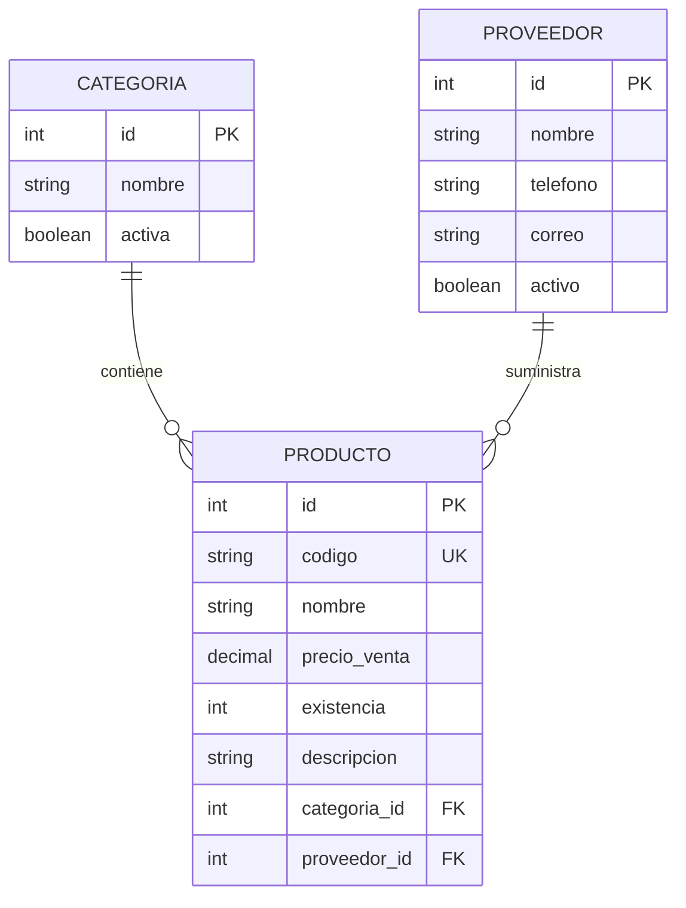

# Practica: Persistencia y relaciones con Spring Data JPA

## Estructura

- `categoria`: entidad, repositorio y controlador para administrar categorias.
- `producto`: entidad, repositorio y controlador para administrar productos.
- `proveedor`: entidad, repositorio y controlador del reto final.
- `db/migration`: migraciones versionadas V1, V2 y V3.

## Diagrama de relaciones



## Endpoints para Postman

Todos usan `Content-Type: application/json`.

| Metodo | URL | Uso |
|---|---|---|
| GET | `/api/categorias` | Listar categorias |
| POST | `/api/categorias` | Crear categoria |
| GET | `/api/productos` | Listar productos |
| POST | `/api/productos` | Crear producto relacionado |
| GET | `/api/proveedores` | Listar proveedores |
| POST | `/api/proveedores` | Crear proveedor |

Categoria:

```json
{
  "nombre": "Computadoras",
  "activa": true
}
```

Proveedor:

```json
{
  "nombre": "Distribuidora Tecnologica",
  "telefono": "2255-0101",
  "correo": "ventas@distribuidora.test",
  "activo": true
}
```

Producto:

```json
{
  "codigo": "LAP-001",
  "nombre": "Laptop Lenovo",
  "categoria": { "id": 1 },
  "proveedor": { "id": 1 },
  "precioVenta": 850.00,
  "existencia": 10,
  "descripcion": "Laptop para oficina"
}
```

Las entidades inversas usan `@JsonIgnore` en sus listas de productos. Asi el producto incluye categoria y proveedor sin producir una referencia circular al serializar JSON.

## Respuestas de comprobacion

1. Spring Data JPA crea una implementacion de acceso a datos a partir de interfaces como `JpaRepository`.
2. Hibernate es la implementacion ORM que transforma objetos Java en registros SQL y viceversa.
3. JPA es una especificacion; Hibernate es una implementacion de esa especificacion.
4. `@Entity` indica que una clase se persiste como una tabla de base de datos.
5. `@ManyToOne` indica que muchos productos pueden pertenecer a una categoria o proveedor.
6. `@JoinColumn` indica la columna que contiene la clave foranea de la relacion.
7. `JpaRepository` proporciona operaciones CRUD, paginacion y consultas basicas sin escribir SQL repetitivo.
8. Las migraciones versionan los cambios del esquema y permiten reproducirlos de forma ordenada.
9. V1 crea las tablas iniciales, V2 agrega la descripcion y V3 crea proveedor y su relacion con producto.
10. Una relacion bidireccional puede producir recursion infinita al convertir las entidades a JSON. Se evita ignorando una de las dos direcciones.

## Evidencias para adjuntar

- Configuracion de `application.properties`.
- Arbol de paquetes bajo `src/main/java`.
- Entidades y anotaciones JPA.
- Diagrama de relaciones incluido arriba.
- Archivos V1, V2 y V3.
- Capturas de respuestas de los seis endpoints principales en Postman.
- Tabla `flyway_schema_history` en PostgreSQL mostrando version 3.
- Tablas `categoria`, `producto` y `proveedor` con sus claves foraneas.

## Conclusion

La aplicacion implementa persistencia con Spring Data JPA y Hibernate sobre PostgreSQL.
Flyway mantiene el esquema mediante migraciones ordenadas y repetibles.
Las entidades representan categorias, productos y proveedores con relaciones JPA.
Los repositorios reducen el codigo necesario para las operaciones de persistencia.
Los controladores exponen endpoints REST para administrar los datos.
La serializacion JSON evita ciclos en las relaciones bidireccionales.
La prueba de Maven confirma que el contexto Spring y las tres migraciones funcionan.